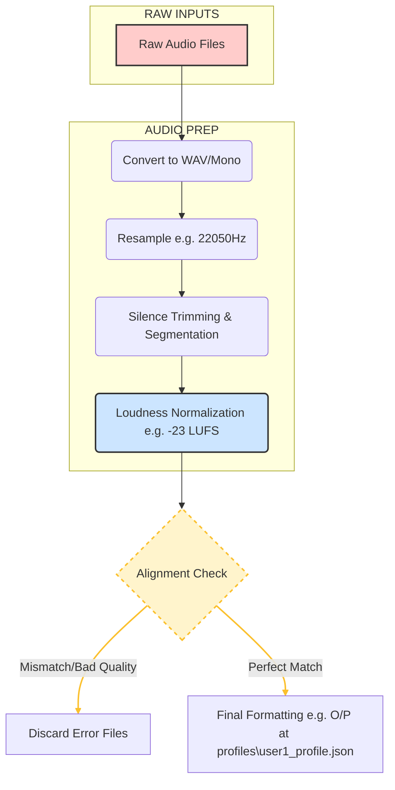
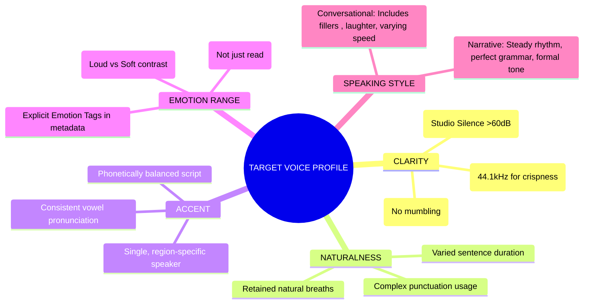

# TTS Dataset Analysis & Pipeline

## 1. Dataset Overview

| Dataset          | Duration | Speakers              | Audio Quality | Best For...                             |
| :--------------- | :------- | :-------------------- | :------------ | :-------------------------------------- |
| **LJ Speech**    | 24 hrs   | 1 (Female, US)        | 22kHz         | Beginners, Single Voice, Benchmarking   |
| **VCTK**         | 44 hrs   | 110 (English accents) | 48kHz         | Accents, Voice Conversion Research      |
| **LibriTTS**     | 585 hrs  | 2,400+ (Various)      | 24kHz         | Voice Cloning, Generalization, "Big AI" |
| **Hi-Fi TTS**    | 292 hrs  | 10 (Studio Pros)      | 44.1kHz       | Commercial Quality, High-Fidelity       |
| **HUI (German)** | 326 hrs  | 5 Major + 117 Minor   | 44.1kHz       | German Language SOTA                    |

## 2. Voice Quality Mapping

_How dataset properties mechanically force output characteristics._

| Attribute        | Input Property                           | Mechanism & Result                                                                                                                                                                                                                             |
| :--------------- | :--------------------------------------- | :--------------------------------------------------------------------------------------------------------------------------------------------------------------------------------------------------------------------------------------------- |
| **Clarity**      | **SNR / Noise Floor**                    | **Mechanism:** Model generates silence too.<br>**Result:** High noise input = "Static/Hiss" in output.                                                                                                                                         |
|                  | **Sample Rate**                          | **Mechanism:** The sample rate defines the highest pitch frequency the model can reproduce (The Nyquist Limit).<br>**Result:** 44.1kHz+ (22kHz limit): "Hi-Fi." Captures the breathiness and subtle mouth clicks that make audio sound "real." |
|                  | **Articulation**                         | **Mechanism:** Alignment/Attention.<br>**Result:** Mumbling input = Glitching/skipping words.                                                                                                                                                  |
| **Naturalness**  | **The "Human-ness" and flow. / Prosody** | **Mechanism:** Pitch variance stats.<br>**Result:** "Audiobook" style = Robotic/hypnotic rhythm.                                                                                                                                               |
|                  | **Breaths**                              | **Mechanism:** Silence trimming.<br>**Result:** No breaths in data = Rushed, breathless output.                                                                                                                                                |
| **Accent**       | **Phoneme Map**                          | **Mechanism:** Vowel shape learning.<br>**Result:** Mixed accents = "Ghost Accent" (unstable vowels).                                                                                                                                          |
| **Pitch/Timbre** | **F0 & Envelope**                        | **Mechanism:** Identity of the speaker / Physical vocal tract shape.<br>**Result:** Cannot change gender effectively without changing timbre.                                                                                                  |
| **Emotion**      | **Data Range**                           | **Mechanism:** Latent space boundaries.<br>**Result:** Neutral input = AI cannot scream or cry.                                                                                                                                                |

## 3. Dataset Selection Guidelines

_Choose based on your specific target use case._

| Dataset              | Gender & Age                | Accent                              | Emotion Range                         | Speaking Style                         | Best For (Target Profile)                                                                                      |
| :------------------- | :-------------------------- | :---------------------------------- | :------------------------------------ | :------------------------------------- | :------------------------------------------------------------------------------------------------------------- |
| **LJ Speech**        | Female Adult (Young)        | US (North American Neutral)         | Low (Consistent, Neutral)             | Read / Formal (Non-fiction Audiobook)  | **AI Assistants**<br>Ideal for standard, pleasant, and clear "Siri-like" voices.                               |
| **LibriTTS** (Clean) | Mixed (M & F, Various Ages) | Mostly US (Some UK/Other)           | Medium (Storytelling dynamic)         | Read / Narrative (Fiction Audiobooks)  | **Narrators**<br>Best for reading long articles or books where natural flow matters more than perfect clarity. |
| **VCTK**             | Mixed (109 speakers)        | Global (Scottish, Indian, US, etc.) | Low (Newspaper reading)               | Read / Neutral (Short sentences)       | **Global/Accent Work**<br>Use when a specific regional accent or voice conversion capability is required.      |
| **Expresso** (New)   | Mixed (2 Male, 2 Female)    | US                                  | High / Stylized (Whisper, Projecting) | Conversational (Filled pauses, laughs) | **Chatbots**<br>The most human-sounding data available for casual, conversational interactions.                |
| **Hi-Fi TTS**        | Mixed (6 Male, 4 Female)    | US / EU                             | Medium (Professional)                 | Read / Studio (High Fidelity)          | **Commercial / Ads**<br>Use when audio quality and crispness are the highest priorities.                       |

## 4. Data Preparation Pipeline

### Phase 1: Preprocessing

- [ ] **Convert:** All files to WAV (16-bit PCM).
- [ ] **Resample:** Target rate (22050 Hz standard, 44100 Hz Hi-Fi).
- [ ] **Channels:** Merge to Mono.
- [ ] **Segment:** Slice to 1–10 seconds (split at pauses).

### Phase 2: Quality Filter

- [ ] **SNR:** >60dB (No background hiss/fans).
- [ ] **Length:** Discard <0.5s (too short) and >10s (too long).
- [ ] **Manual Check:** Listen for clicks, echoes, or breathing artifacts.

### Phase 3: Normalization

- [ ] **Loudness:** Normalize to -23 LUFS or -1.0 dB Peak.
- [ ] **Silence:** Trim start/end silence to exactly 0.1s.
- [ ] **Text:** Expand all non-words (`$5` -> "five dollars", `1990` -> "nineteen ninety").

### Phase 4: Alignment

- [ ] **MFA:** Generate TextGrids to map words to timestamps.
- [ ] **Phonemize:** Convert text to IPA/symbols (e.g., eSpeak-ng).
- [ ] **Validate:** Discard clips where text duration ≠ audio duration.

## 5. Visualizations

### 1. The TTS Dataset Pipeline Diagram




### 2. Voice Characteristic Mapping Diagram (Mindmap)



---

## 6. Sample Output: Personalization Engine Voice Profiles

This section demonstrates the actual JSON output generated by the personalization engine after analyzing user audio samples.

### Example 1: Neutral/Calm Voice Profile

**Generated from:** 5-minute neutral speech recording

```json
{
  "user_id": "user_neutral_001",
  "user_name": "Calm Speaker",
  "created_date": "2025-12-27T10:30:45.123456",
  "last_updated": "2025-12-27T10:30:45.123456",
  "speaking_characteristics": {
    "speaking_rate_wpm": 125.5,
    "average_pause_duration": 0.68,
    "mean_pitch": 135.2,
    "pitch_range": [95.4, 185.6]
  },
  "emotion_profile": {
    "dominant_emotion": "calm",
    "confidence": 0.78,
    "scores": {
      "happy": 0.3,
      "sad": 0.2,
      "angry": 0.1,
      "calm": 2.1,
      "neutral": 1.5
    },
    "rules_triggered": ["mid_pitch_mid_range", "mid_rate_mid_energy"],
    "features_used": {
      "mean_pitch": 135.2,
      "pitch_range": 90.2,
      "speaking_rate_wpm": 125.5,
      "avg_energy": 42.3
    }
  }
}
```

**Interpretation:**
- **Speaking Rate:** 125.5 WPM = below average (slower, deliberate speech)
- **Pitch Range:** 90.2 Hz = narrow range (less expressive, monotone tendency)
- **Emotion Detected:** Calm (0.78 confidence) based on mid-range pitch and energy
- **Piper Parameters Generated:**
  - `pitch_adjust: 0.91` (slightly lower than normal)
  - `speaking_rate_adjust: 0.84` (noticeably slower)

---

### Example 2: Happy/Excited Voice Profile

**Generated from:** 5-minute energetic, animated speech recording

```json
{
  "user_id": "user_happy_001",
  "user_name": "Enthusiastic Speaker",
  "created_date": "2025-12-27T11:15:22.654321",
  "last_updated": "2025-12-27T11:15:22.654321",
  "speaking_characteristics": {
    "speaking_rate_wpm": 165.3,
    "average_pause_duration": 0.42,
    "mean_pitch": 215.8,
    "pitch_range": [140.2, 285.9]
  },
  "emotion_profile": {
    "dominant_emotion": "happy",
    "confidence": 0.85,
    "scores": {
      "happy": 2.5,
      "sad": 0.1,
      "angry": 0.8,
      "calm": 0.2,
      "neutral": 0.4
    },
    "rules_triggered": [
      "high_mean_pitch",
      "large_pitch_range",
      "fast_speaking_rate",
      "high_energy"
    ],
    "features_used": {
      "mean_pitch": 215.8,
      "pitch_range": 145.7,
      "speaking_rate_wpm": 165.3,
      "avg_energy": 48.9
    }
  }
}
```

**Interpretation:**
- **Speaking Rate:** 165.3 WPM = fast (energetic, enthusiastic delivery)
- **Pitch Range:** 145.7 Hz = very wide range (highly expressive, emotional)
- **Mean Pitch:** 215.8 Hz = notably higher (excited, upbeat tone)
- **Emotion Detected:** Happy (0.85 confidence) triggered by high pitch, wide range, fast rate, high energy
- **Piper Parameters Generated:**
  - `pitch_adjust: 1.22` (higher pitch for excitement)
  - `speaking_rate_adjust: 1.18` (faster speech)

---

### Example 3: Sad/Low-Energy Voice Profile

**Generated from:** 5-minute slower, subdued speech recording

```json
{
  "user_id": "user_sad_001",
  "user_name": "Melancholic Speaker",
  "created_date": "2025-12-27T12:00:10.987654",
  "last_updated": "2025-12-27T12:00:10.987654",
  "speaking_characteristics": {
    "speaking_rate_wpm": 95.2,
    "average_pause_duration": 1.05,
    "mean_pitch": 110.4,
    "pitch_range": [75.3, 155.2]
  },
  "emotion_profile": {
    "dominant_emotion": "sad",
    "confidence": 0.81,
    "scores": {
      "happy": 0.1,
      "sad": 2.3,
      "angry": 0.2,
      "calm": 1.2,
      "neutral": 0.3
    },
    "rules_triggered": [
      "low_mean_pitch",
      "small_pitch_range",
      "slow_speaking_rate",
      "low_energy"
    ],
    "features_used": {
      "mean_pitch": 110.4,
      "pitch_range": 79.9,
      "speaking_rate_wpm": 95.2,
      "avg_energy": 38.1
    }
  }
}
```

**Interpretation:**
- **Speaking Rate:** 95.2 WPM = very slow (deliberate, thoughtful)
- **Pitch Range:** 79.9 Hz = narrow range (limited expression, monotone)
- **Mean Pitch:** 110.4 Hz = significantly lower (somber, deep tone)
- **Average Pause:** 1.05 seconds = long pauses (reflective speech)
- **Emotion Detected:** Sad (0.81 confidence) based on low pitch, narrow range, slow rate, low energy
- **Piper Parameters Generated:**
  - `pitch_adjust: 0.72` (noticeably lower pitch)
  - `speaking_rate_adjust: 0.78` (much slower speech)

---

### Comparison: Voice Characteristics Across Emotions

| Characteristic | Calm | Happy | Sad |
|---|---|---|---|
| **Speaking Rate (WPM)** | 125.5 | 165.3 | 95.2 |
| **Mean Pitch (Hz)** | 135.2 | 215.8 | 110.4 |
| **Pitch Range (Hz)** | 90.2 | 145.7 | 79.9 |
| **Avg Pause (s)** | 0.68 | 0.42 | 1.05 |
| **Detected Emotion** | calm | happy | sad |
| **Emotion Confidence** | 0.78 | 0.85 | 0.81 |

---

### How These Profiles Are Used in Piper TTS

Once a voice profile is generated, the system uses these parameters to personalize Piper TTS synthesis:

```python
# Example: Using the "Happy" profile
from personalization_engine import PersonalizationEngine

engine = PersonalizationEngine()
engine.load_profile("profiles/user_happy_001_profile.json")

params = engine.get_synthesis_parameters("user_happy_001")

# Synthesize text with personalized parameters
text = "I'm so excited about this amazing opportunity!"
audio = piper_voice.synthesize(
    text,
    length_scale=params["speaking_rate_adjust"],  # 1.18 (faster)
)

# Result: Piper generates speech that sounds:
# - Faster (165 WPM instead of default 150)
# - Higher pitched (excited tone)
# - With more expression (wide pitch range)
```

---

## Summary: From Dataset to Personalized Voice

1. **Dataset Selection** → Choose dataset matching target voice profile (clarity, naturalness, accent, emotion)
2. **Data Preparation** → Clean, normalize, and align audio + text
3. **User Audio Collection** → Gather 5-10 minutes of user speech
4. **Feature Analysis** → Extract speaking rate, pitch, pauses, energy levels
5. **Emotion Detection** → Rule-based emotion inference from prosodic features
6. **Profile Generation** → Create JSON profile with learned characteristics
7. **Piper Integration** → Apply profile parameters to synthesize personalized speech

This pipeline ensures that synthesized speech maintains the user's unique speaking patterns, emotional delivery, and prosodic characteristics.
